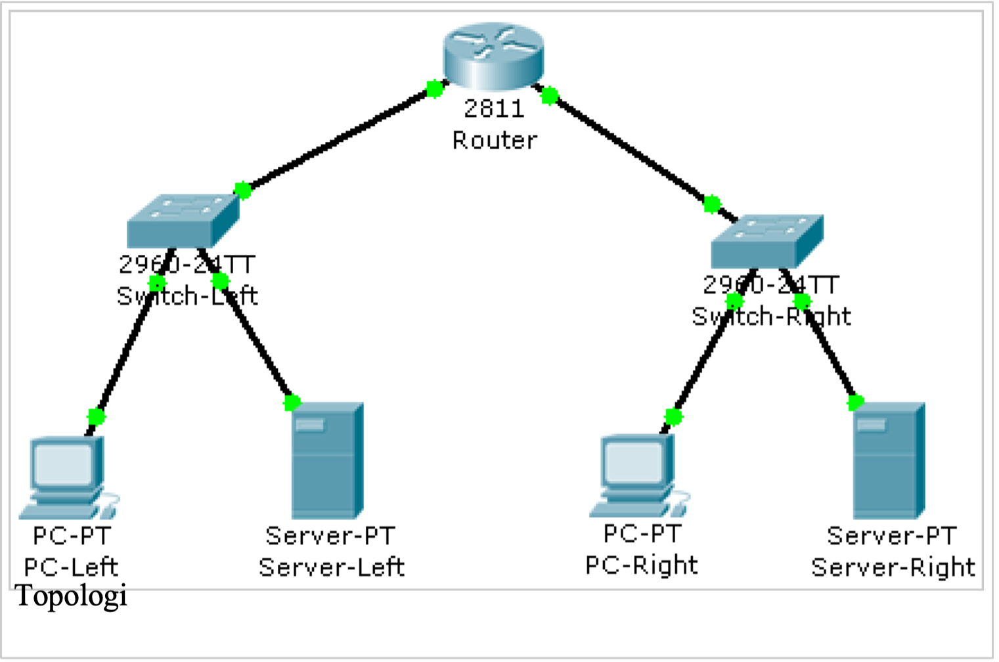

# GNI102 – Lab 1: Introduction to Cisco Packet Tracer

This lab introduces fundamental network simulation using Cisco Packet Tracer. You will construct a small routed network consisting of a router, switches, end-user PCs, and servers, followed by IP configuration and basic network device hardening.

---

## Prerequisites

1. **Host Login:** Log in to the lab computer using the username `cisco` and password `cisco`.
2. **Profile Picture:** Ensure that you have uploaded a profile picture to Canvas ([hv.instructure.com](https://hv.instructure.com/)). This will be verified by an instructor during checkout.
3. **Launch Packet Tracer:** Open **Cisco Packet Tracer** and sign in with your Cisco Networking Academy account.

---

## 1. Network Topology

Build the network topology as shown in the diagram and tables below.



### Device Inventory
Select and place the following devices from the bottom-left equipment menu:
* **Router:** 1 × Cisco `2811` (placed at the top-center)
* **Switches:** 2 × Cisco `2960-24TT` (`Switch-Left` and `Switch-Right`)
* **End Devices (Clients):** 2 × `PC-PT` (`PC-Left` and `PC-Right`)
* **End Devices (Servers):** 2 × `Server-PT` (`Server-Left` and `Server-Right`)

### Cabling (Copper Straight-Through)
Interconnect all devices using Copper Straight-Through cables:

| From Device | Interface | To Device | Interface |
| :--- | :--- | :--- | :--- |
| **PC-Left** | FastEthernet0 | **Switch-Left** | FastEthernet0/1 |
| **Server-Left** | FastEthernet0 | **Switch-Left** | FastEthernet0/2 |
| **PC-Right** | FastEthernet0 | **Switch-Right** | FastEthernet0/1 |
| **Server-Right** | FastEthernet0 | **Switch-Right** | FastEthernet0/2 |
| **Switch-Left** | FastEthernet0/24 | **MainRouter** | FastEthernet0/0 |
| **Switch-Right** | FastEthernet0/24 | **MainRouter** | FastEthernet0/1 |

---

## 2. Basic IP Configuration

Configure device names and addressing using the **Config** tab on each respective device:

| Device | Display / Hostname | Interface | IP Address | Subnet Mask | Default Gateway |
| :--- | :--- | :--- | :--- | :--- | :--- |
| **Router** | `MainRouter` | Fa0/0 | `192.168.1.1` | `255.255.255.0` | — |
| | | Fa0/1 | `192.168.2.1` | `255.255.255.0` | — |
| **Switch Left** | `Switch-Left` | — | — | — | — |
| **Switch Right** | `Switch-Right` | — | — | — | — |
| **PC Left** | `PC-Left` | Fa0 | `192.168.1.10` | `255.255.255.0` | `192.168.1.1` |
| **Server Left** | `Server-Left` | Fa0 | `192.168.1.100` | `255.255.255.0` | `192.168.1.1` |
| **PC Right** | `PC-Right` | Fa0 | `192.168.2.10` | `255.255.255.0` | `192.168.2.1` |
| **Server Right**| `Server-Right` | Fa0 | `192.168.2.100` | `255.255.255.0` | `192.168.2.1` |

> **Note:** Ensure that you enable the router interfaces by checking the **On** box (*Port Status*) for both `Fa0/0` and `Fa0/1`.

---

## 3. Verifying Connectivity

1. Click on **PC-Left**, navigate to the **Desktop** tab, and open the **Command Prompt**.
2. Verify ICMP reachability to the server on the opposite subnet:
   ```cmd
   ping 192.168.2.100

   (The first ping packet may time out while ARP resolves; repeat the command to verify 100% success).
3. Close the Command Prompt and open the Web Browser on PC-Left.
4. Enter the URL: http://192.168.2.100/. Verify that the Cisco Packet Tracer welcome web page displays successfully.

4. Security & Device Hardening (CLI)
Perform device security hardening using the CLI tab.

A. Console and Privileged EXEC Passwords (Router)
1. Open the CLI on MainRouter.
2. Enter privileged EXEC and global configuration mode:
enable
configure terminal

3. Secure console line access with the password cisco:
line console 0
 password cisco
 login
 exit
4. Secure privileged EXEC mode with the password secure:
enable password secure
5. Test your configuration by entering exit repeatedly until logged out completely. Re-authenticate using the console password (cisco), enter privileged mode using enable, and supply the enable password (secure).

B. Secure the Switches
Repeat the exact same password setup on both Switch-Left and Switch-Right using cisco (console) and secure (enable).

C. System Clock Configuration
Manually set the system clock in privileged EXEC mode (#). Use the CLI context-sensitive help (?) to verify the syntax:
clock set hh:mm:ss DD Month YYYY

Verify the timestamp:
show clock

D. Password Encryption
By default, some passwords appear as cleartext in the configuration file. Enable service encryption in global configuration mode:
configure terminal
service password-encryption
exit

Apply this command across MainRouter, Switch-Left, and Switch-Right. Verify using show running-config.

E. Login Banner (MOTD)
Configure a legal warning banner displayed prior to login:
configure terminal
banner motd # Authorized Access Only! Violators will be prosecuted. #
exit

F. Interface Descriptions
Label all active interfaces with descriptive notes.

MainRouter:
interface FastEthernet 0/0
 description Link to Switch-Left
interface FastEthernet 0/1
 description Link to Switch-Right

 Switch-Left:
 interface FastEthernet 0/1
 description Link to PC-Left
interface FastEthernet 0/2
 description Link to Server-Left
interface FastEthernet 0/24
 description Uplink to MainRouter Fa0/0

 Switch-Right:
 interface FastEthernet 0/1
 description Link to PC-Right
interface FastEthernet 0/2
 description Link to Server-Right
interface FastEthernet 0/24
 description Uplink to MainRouter Fa0/1

 G. Save Configuration
Commit the active configuration to NVRAM across all three network devices:
copy running-config startup-config

(Press Enter to confirm the destination filename).

5. Lab Questions
Answer the following questions as part of your lab evaluation:

IOS Image Filename: What is the exact filename of the router's IOS image?

(Hint: Use show version on MainRouter).

Interface MAC Address: What is the MAC address assigned to router interface FastEthernet0/0?

(Hint: Use show interfaces FastEthernet 0/0).

Flash Image Size: What is the size of the IOS image in flash memory, measured in bytes?

(Hint: Use show flash:).

6. Verification & Sign-off Checklist
Have an instructor verify the following items prior to completing the lab:

[ ] Profile photo uploaded to Canvas (hv.instructure.com).

[ ] Web access verified: HTTP session to Server-Right operates from PC-Left.

[ ] Passwords enforced on console and privileged EXEC modes across all devices.

[ ] System clock set and verified via show clock on all network equipment.

[ ] show running-config contains no plain-text passwords.

[ ] All 8 active interfaces properly documented with descriptions.

[ ] Running configuration saved to startup-config.


