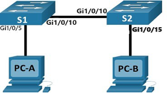
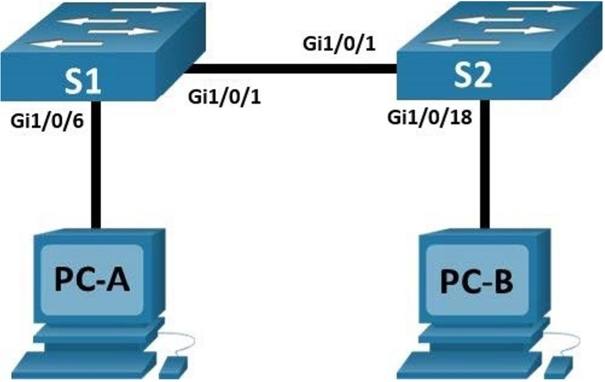
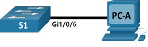

# GNI102 – Lab 3: Switch Configuration, MAC Addresses, and NIC Operations

This lab series covers the fundamentals of Cisco Layer 2 Catalyst switches, the formation and analysis of the switch MAC address table, address resolution, and physical host NIC verification[cite: 2].

---

# Lab 3.1: Basic Switch and End Device Configuration

## Topology

<p align="center">
  
</p>

## Addressing Table

| Device | Interface | IP Address | Subnet Mask | Default Gateway |
| :--- | :--- | :--- | :--- | :--- |
| **S1** | `VLAN 1` | `192.168.1.1` | `255.255.255.0` | *N/A* |
| **S2** | `VLAN 1` | `192.168.1.2` | `255.255.255.0` | *N/A* |
| **PC-A** | `NIC` | `192.168.1.10` | `255.255.255.0` | *N/A* |
| **PC-B** | `NIC` | `192.168.1.11` | `255.255.255.0` | *N/A* |

---

## Objectives

* Set Up the Network Topology[cite: 2]
* Configure PC Hosts[cite: 2]
* Configure and Verify Basic Switch Settings[cite: 2]

---

## Background / Scenario

In this lab, you will build a simple network with two hosts and two switches[cite: 2]. You will configure basic settings including hostnames, passwords, login banners, and Switch Virtual Interfaces (SVI)[cite: 2]. You will also verify end-to-end communication using the `ping` utility[cite: 2].

> **Note:** Ensure both switches have been erased and hold no startup configuration prior to beginning[cite: 2].

---

## Required Resources

* `2×` Switches (Cisco Catalyst 2960 with Cisco IOS 15.0(2) or comparable)[cite: 2]
* `2×` Host PCs (Windows with terminal emulation, such as PuTTY)[cite: 2]
* Console and Ethernet patch cables[cite: 2]

---

## Step-by-Step Instructions

### Step 1: Cable the Network Topology
1. Interconnect switch port `Gi1/0/10` on **S1** to `Gi1/0/10` on **S2**[cite: 2].
2. Connect **PC-A** to port `Gi1/0/5` on **S1**[cite: 2].
3. Connect **PC-B** to port `Gi1/0/15` on **S2**[cite: 2].
4. Power on all hardware devices[cite: 2].

### Step 2: Configure Host Addressing
Assign static IPv4 addresses and subnet masks to **PC-A** and **PC-B** according to the Addressing Table[cite: 2].

### Step 3: Configure Basic Switch Settings
Console into each switch and complete the baseline configurations without referring to the appendix if possible[cite: 2]:

```ios
enable
clock set 09:15:00 21 SEP 2026
configure terminal
hostname S1
no ip domain-lookup
enable password class
banner motd # UNAUTHORIZED ACCESS FORBIDDEN! #
service password-encryption
line console 0
 password cisco
 login
 exit
interface vlan 1
 ip address 192.168.1.1 255.255.255.0
 no shutdown
 description Link to MANAGEMENT
 exit
interface Gi1/0/10
 description Link to S2
interface Gi1/0/5
 description Link to PC-A
exit
copy running-config startup-config
```

*(Repeat configuration on **S2** using hostname `S2`, IP address `192.168.1.2`, and port description for **PC-B** on `Gi1/0/15`)*[cite: 2].

### Step 4: Verification and Connectivity Tests
Execute the verification commands:
```ios
show clock
show running-config
show version
show ip interface brief
```

* **PC-A to PC-B Verification:** From **PC-A**, ping **PC-B** (`ping 192.168.1.11`)[cite: 2].  
  *Is the ping successful? (Yes/No):*  
  ______________________________________________________________________

* **S1 to S2 Verification:** From **S1**, ping **S2** (`ping 192.168.1.2`)[cite: 2].  
  *Is the ping successful? (Yes/No):*  
  ______________________________________________________________________

---

## Clean-up (Lab 3.1)
Erase configuration and reload both switches before continuing[cite: 2]:
```ios
erase startup-config
reload
```

---
---

# Lab 3.2: View the Switch MAC Address Table

## Topology



## Addressing Table

| Device | Interface | IP Address | Subnet Mask | Default Gateway |
| :--- | :--- | :--- | :--- | :--- |
| **S1** | `VLAN 1` | `192.168.1.11` | `255.255.255.0` | *N/A* |
| **S2** | `VLAN 1` | `192.168.1.12` | `255.255.255.0` | *N/A* |
| **PC-A** | `NIC` | `192.168.1.1` | `255.255.255.0` | *N/A* |
| **PC-B** | `NIC` | `192.168.1.2` | `255.255.255.0` | *N/A* |

---

## Objectives

* **Part 1:** Build and Configure the Network[cite: 2]
* **Part 2:** Examine the Switch MAC Address Table[cite: 2]

---

## Instructions

### Part 1: Build and Configure the Network
1. Cable devices according to the topology (`F0/1` between switches, `F0/6` to **PC-A**, `F0/18` to **PC-B**)[cite: 2].
2. Configure IP parameters on PCs and Switch SVIs[cite: 2].
3. Apply passwords: `cisco` (console/vty) and `class` (privileged EXEC)[cite: 2].

### Part 2: Examine the Switch MAC Address Table

#### Step 1: Record Network Device MAC Addresses
Open a command prompt on both PCs and record their physical addresses via `ipconfig /all`[cite: 2]:

* **PC-A MAC Address:**  
  ______________________________________________________________________  
  ______________________________________________________________________

* **PC-B MAC Address:**  
  ______________________________________________________________________  
  ______________________________________________________________________

Console into **S1** and **S2** and record the Burned-in Address (bia) via `show interface gi1/0/1` (or relevant trunk port)[cite: 2]:

* **S1 Gi1/0/1 (or F0/1) MAC Address:**  
  ______________________________________________________________________  
  ______________________________________________________________________

* **S2 Gi1/0/1 (or F0/1) MAC Address:**  
  ______________________________________________________________________  
  ______________________________________________________________________

#### Step 2: Display the MAC Address Table
From privileged EXEC mode on **S2**, execute[cite: 2]:
```ios
show mac address-table
```

* **Question:** What MAC addresses are recorded in the table, to which ports are they mapped, and to which devices do they belong?[cite: 2]  
  *Answer:*  
  ______________________________________________________________________  
  ______________________________________________________________________

#### Step 3: Clear and Re-evaluate Dynamic Entries
Clear dynamic entries and view the table[cite: 2]:
```ios
clear mac address-table dynamic
show mac address-table
```

* **Question:** Does the table contain any addresses immediately after clearing? What happens after 10–15 seconds?[cite: 2]  
  *Answer:*  
  ______________________________________________________________________  
  ______________________________________________________________________

#### Step 4: Traffic Generation & ARP Verification
1. On **PC-B**, check the ARP table:
   ```cmd
   arp -a
   ```
2. Ping **PC-A**, **S1**, and **S2** from **PC-B**[cite: 2].
3. Check `show mac address-table` on **S2** again[cite: 2].
4. Rerun `arp -a` on **PC-B**[cite: 2].

* **Question:** Has the switch added additional dynamic MAC addresses after traffic generation? List the new additions:[cite: 2]  
  *Answer:*  
  ______________________________________________________________________  
  ______________________________________________________________________

---

## Clean-up (Lab 3.2)
Reset devices before proceeding[cite: 2]:
```ios
erase startup-config
reload
```

---
---

# Lab 3.3: View Network Device MAC Addresses

## Topology



## Addressing Table

| Device | Interface | IP Address | Subnet Mask | Default Gateway |
| :--- | :--- | :--- | :--- | :--- |
| **S1** | `VLAN 1` | `192.168.1.2` | `255.255.255.0` | *N/A* |
| **PC-A** | `NIC` | `192.168.1.3` | `255.255.255.0` | `192.168.1.1` |

---

## Step-by-Step Instructions

### Step 1: Device Configuration & Verification
1. Connect **PC-A** to port `Gi1/0/6` on **S1**[cite: 2].
2. Configure **PC-A** with IP `192.168.1.3`, mask `255.255.255.0`, and gateway `192.168.1.1`[cite: 2].
3. On **S1**, configure:
   ```ios
   configure terminal
   hostname S1
   no ip domain-lookup
   interface vlan 1
    ip address 192.168.1.2 255.255.255.0
    no shutdown
    end
   ```
4. Ping `192.168.1.2` from **PC-A**[cite: 2].

### Step 2: Analyze the MAC Address for the PC-A NIC
Run `ipconfig /all` on **PC-A** and evaluate the 48-bit physical address[cite: 2]:

* **Question 1:** What is the OUI portion (first 3 bytes / 6 hex digits) of your NIC's MAC address?[cite: 2]  
  *Answer:*  
  ______________________________________________________________________  
  ______________________________________________________________________

* **Question 2:** What is the vendor serial number portion (last 3 bytes / 6 hex digits)?[cite: 2]  
  *Answer:*  
  ______________________________________________________________________  
  ______________________________________________________________________

* **Question 3:** Using an IEEE OUI lookup tool, what vendor manufactured the NIC?[cite: 2]  
  *Answer:*  
  ______________________________________________________________________  
  ______________________________________________________________________

### Step 3: Analyze the MAC Address on Switch S1
Console into **S1** and run[cite: 2]:
```ios
show interfaces vlan 1
show arp
show mac address-table
```

* **Question 1:** What is the MAC address for interface `VLAN 1` on **S1**?[cite: 2]  
  *Answer:*  
  ______________________________________________________________________  
  ______________________________________________________________________

* **Question 2:** What does the abbreviation `bia` stand for in the interface output?[cite: 2]  
  *Answer:*  
  ______________________________________________________________________  
  ______________________________________________________________________

* **Question 3:** Did `show mac address-table` display the MAC address of **PC-A**? What port was it mapped to?[cite: 2]  
  *Answer:*  
  ______________________________________________________________________  
  ______________________________________________________________________

---
---

# Lab 3.4: View Wired and Wireless NIC Information

## Objectives

* **Part 1:** Identify and Work with PC NICs[cite: 2]
* **Part 2:** Identify and Use System Tray Network Icons[cite: 2]

---

## Step-by-Step Instructions

### Part 1: Work with PC NICs

#### Step 1: Network Connections
1. Open **Control Panel** $\rightarrow$ **Network and Internet** $\rightarrow$ **Network and Sharing Center**[cite: 2].
2. Click **Change adapter settings** in the left panel[cite: 2].

#### Step 2: Wireless NIC Verification
1. Right-click the **Wi-Fi** adapter and select **Status**[cite: 2].
2. Answer the following from the **Status** and **Details** windows[cite: 2]:

* **SSID of your connection:**  
  ______________________________________________________________________  
  ______________________________________________________________________

* **Speed of your connection:**  
  ______________________________________________________________________  
  ______________________________________________________________________

* **MAC Address of the Wireless NIC:**  
  ______________________________________________________________________  
  ______________________________________________________________________

* **Why would multiple IPv4 DNS servers be listed?**[cite: 2]  
  *Answer:*  
  ______________________________________________________________________  
  ______________________________________________________________________

#### Step 3: Wired Ethernet NIC Verification
1. Connect an Ethernet cable to your local LAN adapter[cite: 2].
2. Right-click **Ethernet** $\rightarrow$ **Status** $\rightarrow$ **Details...**[cite: 2]
3. Run `ipconfig /all` in the Command Prompt to compare output with the GUI[cite: 2].

---

### Part 2: System Tray Network Indicators & Reflection

1. Disable Wi-Fi and Ethernet in **Network Connections** and observe the system tray icon[cite: 2].
2. Run the Windows **Troubleshoot** feature or re-enable adapters manually[cite: 2].

* **Reflection Question:** Why would an administrator or user activate more than one NIC simultaneously on a single computer system?[cite: 2]  
  *Answer:*  
  ______________________________________________________________________  
  ______________________________________________________________________

---

## Sign-off Checklist (Lab 3 Series)

Before leaving the lab session, have an instructor verify your work:

- [ ] Baseline configurations, SVIs, and host addressing active on S1, S2, and PCs[cite: 2].
- [ ] End-to-end ICMP reachability (`ping`) verified across all devices[cite: 2].
- [ ] Dynamic MAC address table behavior examined on switch console[cite: 2].
- [ ] Hardware OUI and physical addresses analyzed and documented[cite: 2].
- [ ] Host NIC states and system tray icons verified[cite: 2].
- [ ] All hardware switch configurations erased and reloaded prior to exit (`erase startup-config`)[cite: 2].
