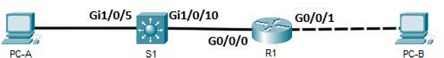

# GNI102 – Lab 4: Router and Switch Network Configuration (IPv4 and IPv6)

---

# Lab 4.1 – Build a Switch and Router Network

## Topology

<p align="center">
  
</p>

## Addressing Table

| Device | Interface | IP Address / Prefix | Default Gateway |
| :--- | :--- | :--- | :--- |
| **R1** | `G0/0/0` | `192.168.0.1/24`<br>`2001:db8:acad::1/64`<br>`fe80::1` *(link-local)* | *N/A* |
| | `G0/0/1` | `192.168.1.1/24`<br>`2001:db8:acad:1::1/64`<br>`fe80::1` *(link-local)* | *N/A* |
| **S1** | `VLAN 1` | `192.168.1.2/24` | `192.168.1.1` |
| **PC-A** | `NIC` | `192.168.1.3/24`<br>`2001:db8:acad:1::3/64` | `192.168.1.1`<br>`fe80::1` |
| **PC-B** | `NIC` | `192.168.0.3/24`<br>`2001:db8:acad::3/64` | `192.168.0.1`<br>`fe80::1` |

---

## Objectives

* **Part 1:** Set Up the Topology and Initialize Devices
* **Part 2:** Configure Devices and Verify Connectivity
* **Part 3:** Display Device Information

---

## Background / Scenario

This is a comprehensive lab to review previously covered IOS commands. In this lab, you will cable the equipment as shown in the topology diagram. You will then configure the devices to match the addressing table. After the configurations have been saved, you will verify your configurations by testing for network connectivity.

After the devices have been configured and network connectivity has been verified, you will use IOS commands to retrieve information from the devices to answer questions about your network equipment.

This lab provides minimal assistance with the actual commands necessary to configure the router. Test your knowledge by trying to configure the devices without referring to the content or previous activities.

> **Note:** The routers used with CCNA hands-on labs are Cisco 4221 with Cisco IOS XE Release 16.9.4 (universalk9 image). The switches used in the labs are Cisco Catalyst 2960s with Cisco IOS Release 15.2(2) (lanbasek9 image). Other routers, switches, and Cisco IOS versions can be used. Depending on the model and Cisco IOS version, the commands available and the output produced might vary from what is shown in the labs.
>
> **Note:** Ensure that the routers and switches have been erased and have no startup configurations. Consult with your instructor for the procedure to initialize and reload a router and switch.
>
> **Note:** The default bias template used by the Switch Database Manager (SDM) does not provide IPv6 address capabilities. Verify that SDM is using either the `dual-ipv4-and-ipv6` template or the `lanbase-routing` template. The new template will be used after reboot even if the configuration is not saved.

---

## Required Resources

* 1 Router (Cisco 4221 with Cisco IOS XE Release 16.9.4 universal image or comparable)
* 1 Switch (Cisco 2960 with Cisco IOS Release 15.2(2) lanbasek9 image or comparable)
* 2 PCs (Windows with a terminal emulation program, such as Tera Term)
* Console cables to configure the Cisco IOS devices via the console ports
* Ethernet cables as shown in the topology

> **Note:** The Gigabit Ethernet interfaces on Cisco 4221 routers are autosensing and an Ethernet straight-through cable may be used between the router and PC-B. If using another model Cisco router, it may be necessary to use an Ethernet crossover cable.

---

## Instructions

### Part 1: Set Up Topology and Initialize Devices

#### Step 1: Cable the network as shown in the topology.
a. Attach the devices shown in the topology diagram, and cable, as necessary.  
b. Power on all the devices in the topology.

#### Step 2: Initialize and reload the router and switch.
If configuration files were previously saved on the router and switch, initialize and reload these devices back to their default configurations.

---

### Part 2: Configure Devices and Verify Connectivity

In Part 2, you will set up the network topology and configure basic settings, such as the interface IP addresses, device access, and passwords. Refer to the Addressing Table at the beginning of this lab for device names and address information.

#### Step 1: Assign static IP information to the PC interfaces.
a. Configure the IP address, subnet mask, and default gateway settings on PC-A.  
b. Configure the IP address, subnet mask, and default gateway settings on PC-B.  
c. Ping PC-B from a command prompt window on PC-A.  
*(Note: If pings are not successful, the Windows Firewall may need to be turned off).*

Why were the pings not successful?  
______________________________________________________________________  
______________________________________________________________________

<br>

#### Step 2: Configure the router.
a. Console into the router and enable privileged EXEC mode.  
b. Enter configuration mode.  
c. Assign a device name to the router.  
d. Disable DNS lookup to prevent the router from attempting to translate incorrectly entered commands as though they were host names.  
e. Assign `class` as the privileged EXEC encrypted password.  
f. Assign `cisco` as the console password and enable login.  
g. Assign `cisco` as the VTY password and enable login.  
h. Encrypt the plaintext passwords.  
i. Create a banner that warns anyone accessing the device that unauthorized access is prohibited.  
j. Configure and activate both interfaces on the router.  
k. Configure an interface description for each interface indicating which device is connected to it.  
l. To enable IPv6 routing, enter the command `ipv6 unicast-routing`:
```ios
R1(config)# ipv6 unicast-routing
```
m. Save the running configuration to the startup configuration file.  
n. Set the correct time on the router.  
*(Note: Use the question mark `?` to help with the correct sequence of parameters needed to execute this command).*  
o. Ping PC-B from a command prompt window on PC-A.  
*(Note: If pings are not successful, the Windows Firewall may need to be turned off).*

Were the pings successful? Explain.  
______________________________________________________________________  
______________________________________________________________________

<br>

#### Step 3: Configure the switch.
In this step, you will configure the hostname, the VLAN 1 interface and its default gateway.

a. Console into the switch and enable privileged EXEC mode.  
b. Enter configuration mode.  
c. Assign a device name to the switch.  
d. Disable DNS lookup to prevent the router from attempting to translate incorrectly entered commands as though they were host names.  
e. Configure and activate the VLAN interface on the switch S1.  
f. Configure the default gateway for the switch S1.  
g. Save the running configuration to the startup configuration file.

#### Step 4: Verify end-to-end connectivity.
a. From PC-A, ping PC-B.  
b. From S1, ping PC-B.  
*(All the pings should be successful).*

---

### Part 3: Display Device Information

In Part 3, you will use `show` commands to retrieve interface and routing information from the router and switch.

#### Step 1: Display the routing table on the router.

a. Use the `show ip route` command on the router R1 to answer the following questions:

* What code is used in the routing table to indicate a directly connected network?  
  ______________________________________________________________________  
  ______________________________________________________________________

* How many route entries are coded with a `C` code in the routing table?  
  ______________________________________________________________________  
  ______________________________________________________________________

* What interface types are associated to the `C` coded routes?  
  ______________________________________________________________________  
  ______________________________________________________________________

b. Use the `show ipv6 route` command on router R1 to display the IPv6 routes.

<br>

#### Step 2: Display interface information on the router R1.

a. Use the `show interface G0/0/1` command to answer the following questions:

* What is the operational status of the `G0/0/1` interface?  
  ______________________________________________________________________  
  ______________________________________________________________________

* What is the Media Access Control (MAC) address of the `G0/0/1` interface?  
  ______________________________________________________________________  
  ______________________________________________________________________

* How is the Internet address displayed in this command?  
  ______________________________________________________________________  
  ______________________________________________________________________

b. For the IPv6 information, enter the `show ipv6 interface` command.

<br>

#### Step 3: Display a summary list of the interfaces on the router and switch.

There are several commands that can be used to verify an interface configuration. One of the most useful of these is the `show ip interface brief` command. The command output displays a summary list of the interfaces on the device and provides immediate feedback to the status of each interface.

a. Enter the `show ip interface brief` command on the router R1:
```ios
R1# show ip interface brief
```

b. To see the IPv6 interface information, enter the `show ipv6 interface brief` command on R1:
```ios
R1# show ipv6 interface brief
```

c. Enter the `show ip interface brief` command on the switch S1:
```ios
S1# show ip interface brief
```

---

## Reflection Questions (Lab 4.1)

1. If the `G0/0/1` interface showed that it was administratively down, what interface configuration command would you use to turn the interface up?  
   ______________________________________________________________________  
   ______________________________________________________________________

<br>

2. What would happen if you had incorrectly configured interface `G0/0/1` on the router with an IP address of `192.168.1.2`?  
   ______________________________________________________________________  
   ______________________________________________________________________

---

## Clean-up (Lab 4.1)

Erase the configuration and reload both the switch and router:
```ios
R1# erase startup-config
R1# reload

S1# erase startup-config
S1# reload
```

---
---

# Lab 4.2 – Check Your Configuration

## Topology

<p align="center">
  
</p>

## Addressing Table

| Device | Interface | IP Address / Prefix | Default Gateway |
| :--- | :--- | :--- | :--- |
| **R1** | `G0/0/0` | `192.168.0.1/24`<br>`2001:db8:acad:a::1/64`<br>`fe80::1` *(link-local)* | *N/A* |
| | `G0/0/1` | `192.168.1.1/24`<br>`2001:db8:acad:b::1/64`<br>`fe80::1` *(link-local)* | *N/A* |
| **S1** | `VLAN 1` | `192.168.0.2/24`<br>`2001:db8:acad:a::2/64`<br>`fe80::2` *(link-local)* | `192.168.0.1` |
| **PC-A** | `NIC` | `192.168.0.10/24`<br>`2001:db8:acad:a::10/64` | `192.168.0.1`<br>`2001:db8:acad:a::1` |
| **PC-B** | `NIC` | `192.168.1.10/24`<br>`2001:db8:acad:b::10/64` | `192.168.1.1`<br>`2001:db8:acad:b::1` |

---

## Objectives

* Set Up the Network Topology
* Configure PC Hosts
* Configure and Verify Configuration

---

## Background / Scenario

In this lab, you will build a simple network with two hosts, 1 switch and 1 router. You will also configure basic settings including hostname, local passwords, and login banner. Use show commands to display the running configuration, IOS version, and interface status. Use the copy command to save device configurations.

You will apply IP addressing for this lab to the PCs and switches to enable communication between the devices. Use the ping utility to verify connectivity.

> **Note:** Make sure that the switches have been erased and have no startup configurations.

---

## Required Resources

* 1 Switch (Cisco 2960 with Cisco IOS Release 15.0(2) lanbasek9 image or comparable)
* 2 PCs (Windows with terminal emulation program, such as PuTTY)
* 1 Router
* Console cables to configure the Cisco IOS devices via the console ports
* Ethernet cables as shown in the topology

---

## Instructions

### Step 1: Set Up the Network Topology
In this step, you will cable the devices together according to the network topology.

a. Power on the devices.  
b. Connect the cables according to the Topology (`Gi1/0/5` to PC-A, `Gi1/0/10` to R1 `G0/0/0`, R1 `G0/0/1` to PC-B).  
c. Visually inspect network connections.

### Step 2: Configure PC Hosts
a. Configure static IP address information on the PCs according to the Addressing Table.  
b. Verify PC settings and connectivity.

### Step 3: Configure and Verify Basic Switch Settings
**Note:** Do the following steps <u>without</u> checking the appendix.

a. Do the following configuration on **both the switch and router**:
1) Set the correct time in privileged EXEC mode.
2) Set correct hostname according to the Addressing Table in global configuration mode.
3) Disable unwanted DNS lookups.
4) Use `class` as privileged EXEC password.
5) Enter a login MOTD banner to warn unauthorized access.
6) Encrypt plain text passwords.
7) Enable `ipv6 unicast-routing`.
8) Use `cisco` as line console password.
9) Configure and enable the interfaces according to the Addressing Table.
10) Set descriptions on appropriate interfaces.
11) Save the configuration.

c. From **PC-A**, send a ping to `192.168.1.10`. The pings should be successful.  
d. From **PC-B**, send a ping to `2001:db8:acad:a::10`. The pings should be successful.

### Step 4: Verify with show commands

a. What is used to list the same information as `show ip interface brief` but with IPv6 addresses instead?  
*Answer:*  
______________________________________________________________________  
______________________________________________________________________

<br>

b. What is used to list the routing table of R1?  
*Answer:*  
______________________________________________________________________  
______________________________________________________________________

<br>

c. What is used to list the currently active sdm template on the switch?  
*Answer:*  
______________________________________________________________________  
______________________________________________________________________

---

## Reflection Questions (Lab 4.2)

Check the appendix and compare your configuration. Did you do anything differently? Can you find a command not used before?  
*Answer:*  
______________________________________________________________________  
______________________________________________________________________

---

## Clean-up (Lab 4.2)

Erase the configuration and reload both the switch and router:
```ios
R1# erase startup-config
R1# reload

S1# erase startup-config
S1# reload
```

---

## Appendix A (Lab 4.2 Reference Configurations)

### S1 Configuration Reference:
```ios
Switch>enable
Switch#conf t
Switch(config)#hostname S1
S1(config)#no ip domain lookup
S1(config)#ip default-gateway 192.168.0.1
S1(config)#service password-encryption
S1(config)#enable secret class
S1(config)#banner motd % UNAUTHORIZED ACCESS FORBIDDEN! %
S1(config)#ipv6 unicast-routing
S1(config)#line con 0
S1(config-line)#password cisco
S1(config-line)#login
S1(config-line)#logging synchronous
S1(config-line)#line vty 0 15
S1(config-line)#password cisco
S1(config-line)#login
S1(config-line)#logging synchronous
S1(config-line)#transport input ssh
S1(config-line)#int gi1/0/5
S1(config-if)#description Link to PC-A
S1(config-if)#no shut
S1(config-line)#int gi1/0/10
S1(config-if)#description Link to R1
S1(config-if)#no shut
S1(config-line)#int vlan 1
S1(config-if)#description MANAGEMENT
S1(config-if)#ip address 192.168.0.2 255.255.255.0
S1(config-if)#ipv6 address 2001:db8:acad:a::2/64
S1(config-if)#ipv6 address fe80::2 link-local
S1(config-if)#no shut
```

### R1 Configuration Reference:
```ios
Router>enable
Router#conf t
Router(config)#hostname R1
R1(config)#no ip domain lookup
R1(config)#service password-encryption
R1(config)#enable secret class
R1(config)#banner motd % UNAUTHORIZED ACCESS FORBIDDEN! %
R1(config)#ipv6 unicast-routing
R1(config)#line con 0
R1(config-line)#password cisco
R1(config-line)#login
R1(config-line)#logging synchronous
R1(config-line)#line vty 0 15
R1(config-line)#password cisco
R1(config-line)#login
R1(config-line)#logging synchronous
R1(config-line)#transport input ssh
R1(config-line)#int g0/0/0
R1(config-if)#ip address 192.168.0.1 255.255.255.0
R1(config-if)#description Link to S1
R1(config-if)#ipv6 address 2001:db8:acad:a::1/64
R1(config-if)#ipv6 address fe80::1 link-local
R1(config-if)#no shut
R1(config-if)#int g0/0/1
R1(config-if)#ip address 192.168.1.1 255.255.255.0
R1(config-if)#description Link to PC-B
R1(config-if)#ipv6 address 2001:db8:acad:b::1/64
R1(config-if)#ipv6 address fe80::1 link-local
R1(config-if)#no shut
R1(config-if)#end
```
